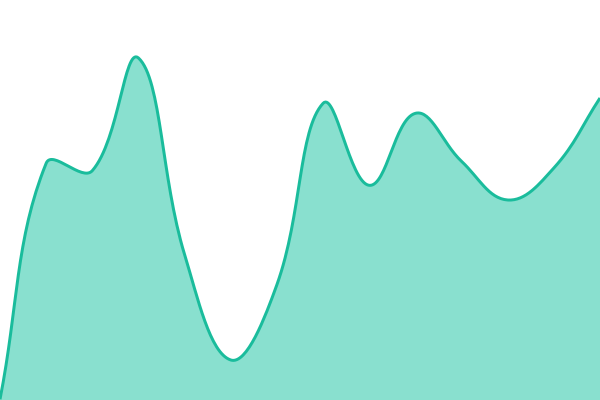
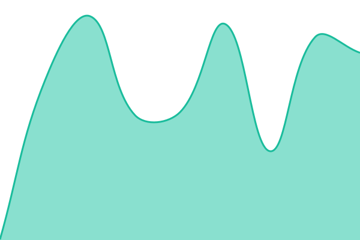
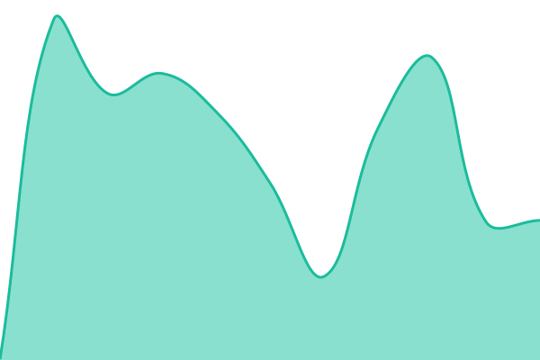

# [📈 Live Status](https://status.yourpartnerpartner.com): <!--live status--> **🟩 All systems operational**

This repository contains the open-source uptime monitor and status page for [PCollective](https://status.yourpartnerpartner.com), powered by [Upptime](https://github.com/upptime/upptime).

With [Upptime](https://upptime.js.org), you can get your own unlimited and free uptime monitor and status page, powered entirely by a GitHub repository. We use [Issues](https://github.com/PCollective/status/issues) as incident reports, [Actions](https://github.com/PCollective/status/actions) as uptime monitors, and [Pages](https://status.yourpartnerpartner.com) for the status page.

<!--start: status pages-->
<!-- This summary is generated by Upptime (https://github.com/upptime/upptime) -->
<!-- Do not edit this manually, your changes will be overwritten -->
<!-- prettier-ignore -->
| URL | Status | History | Response Time | Uptime |
| --- | ------ | ------- | ------------- | ------ |
|  [Partner Partner App](https://app.yourpartnerpartner.com) | 🟩 Up | [partner-partner-app.yml](https://github.com/PCollective/status/commits/HEAD/history/partner-partner-app.yml) | 

 447ms
     
 | 

<a href="https://status.yourpartnerpartner.com/history/partner-partner-app">100.00%</a>
    

|  [Website](https://yourpartnerpartner.com) | 🟩 Up | [website.yml](https://github.com/PCollective/status/commits/HEAD/history/website.yml) | 

 355ms
     
 | 

<a href="https://status.yourpartnerpartner.com/history/website">100.00%</a>
    

|  [Fractional Partners](https://partners.yourpartnerpartner.com) | 🟩 Up | [fractional-partners.yml](https://github.com/PCollective/status/commits/HEAD/history/fractional-partners.yml) | 

 483ms
     
 | 

<a href="https://status.yourpartnerpartner.com/history/fractional-partners">100.00%</a>
    

|  [Mantle Connect Bridge](https://connect.yourpartnerpartner.com) | 🟩 Up | [mantle-connect-bridge.yml](https://github.com/PCollective/status/commits/HEAD/history/mantle-connect-bridge.yml) | 

 503ms
     
 | 

<a href="https://status.yourpartnerpartner.com/history/mantle-connect-bridge">100.00%</a>
    

|  [Migration Center](https://migrate.yourpartnerpartner.com) | 🟩 Up | [migration-center.yml](https://github.com/PCollective/status/commits/HEAD/history/migration-center.yml) | 

 474ms
     
 | 

<a href="https://status.yourpartnerpartner.com/history/migration-center">100.00%</a>
    

<!--end: status pages-->

[**Visit our status website →**](https://status.yourpartnerpartner.com)

## 📄 License

- Powered by: [Upptime](https://github.com/upptime/upptime)
- Code: [MIT](./LICENSE) © [Anand Chowdhary](https://anandchowdhary.com)
- Data in the `./history` directory: [Open Database License](https://opendatacommons.org/licenses/odbl/1-0/)
